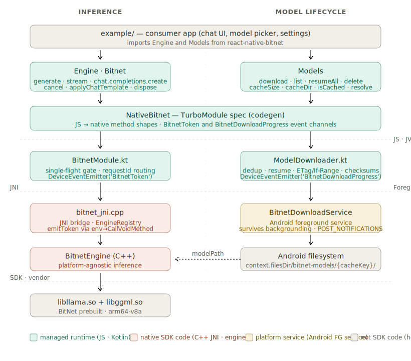

# Architecture

`react-native-bitnet` exposes BitNet (a 1.58-bit quantized LLM running on llama.cpp) as a React Native module. The stack has seven layers spanning three runtime environments — JavaScript, the JVM, and native C++.

## The stack

**`apps/demo`.** The example app — a chat UI that exercises the public API the way a real consumer would. It owns the message list, the typing indicator, the cancel button, and the model-load lifecycle. It depends on nothing in the SDK except the public TypeScript surface.

**`Engine` / `Bitnet`** (`src/index.tsx`). The public TypeScript API. `Engine.load()` is a static factory that returns a handle-wrapped instance; instance methods are `generate`, `stream`, `cancel`, `applyChatTemplate`, `modelInfo`, and `dispose`. This is the only file a consumer needs to read to use the SDK. Streaming is exposed two ways: an `onToken` callback on `generate()` (push) and an async iterable returned by `stream()` (pull). Both are surfaces over the same underlying `BitnetToken` event stream.

**`NativeBitnet`** (`src/NativeBitnet.ts`). The TurboModule spec. Declarative — no logic. React Native's codegen reads this file at build time and generates the C++ glue that marshals each method's arguments across the JS-to-JVM boundary. Every parameter type is constrained to what codegen supports: `string`, `number`, `boolean`, arrays of those, or a JSON-stringified object for anything richer (chat messages). Promise return types only — no synchronous calls.

**Boundary: JS / JVM.** Method calls become serialized parameter packets dispatched onto the React Native module thread. Token events flow the other way as `WritableMap`s through `DeviceEventEmitter`.

**`BitnetModule.kt`** (`android/src/main/java/com/bitnet/BitnetModule.kt`). The Kotlin native module. Declares external native methods, marshals their arguments to JNI-compatible types, runs `generate` on a background `Thread{}.start()` so the JS thread isn't blocked, and provides the `emitToken` callback the JNI layer calls back into for each generated token. Loads `libbitnet_rn.so` via `System.loadLibrary` in its companion object.

**Boundary: JNI.** The hard interop boundary — Java Native Interface calls into C++. Symbol naming follows JNI conventions (`Java_com_bitnet_BitnetModule_nativeGenerate`). Symbol visibility is forced to `default` in the CMake config because NDK r30's Clang strips JNIEXPORT symbols from the dynamic table by default — see `native-build.md`.

**`bitnet_jni.cpp`** (`android/src/main/cpp/bitnet_jni.cpp`). The JNI bridge. Six C functions implementing the native methods declared in Kotlin. Holds an `EngineRegistry` — a mutex-protected map from integer handles to `unique_ptr<BitnetEngine>` — so JS can address multiple loaded models with simple numeric handles instead of opaque pointers. Translates `jstring` ↔ `std::string`, parses the chat-message JSON, and invokes the engine. The token callback is constructed here and passed down into the engine; when it fires, this layer calls back up into Kotlin's `emitToken`.

**`BitnetEngine`** (`android/src/main/cpp/bitnet_engine.cpp`, `.h`). The actual inference engine. Holds the `llama_model` and `llama_context`. Owns the decode loop: tokenize prompt → loop `llama_decode` → sample → detokenize piece → invoke callback → repeat until EOS. Platform-agnostic — no JNI, no Kotlin, no React Native. The exact same class compiles and runs on macOS for testing.

**Boundary: SDK / vendor.** Below this line is code the SDK doesn't own.

**`libllama.so` + `libggml.so`.** The vendored prebuilts — BitNet's pinned fork of llama.cpp, cross-compiled for `arm64-v8a` and dropped into `android/src/main/jniLibs/arm64-v8a/`. The SDK doesn't build these as part of its consumer-facing Gradle build (that would force every consumer to set up the NDK, run Python codegen, and wait 15 minutes per build). Reproduction steps are documented in [`native-build.md`](./native-build.md).

## Colour coding

The diagram uses three colour groups:

- **Gray** — code the SDK does not own. The demo app (consumers will replace it) and the vendored prebuilts (BitNet's llama.cpp fork).
- **Teal** — SDK code running in a managed runtime. JavaScript on top, Kotlin underneath.
- **Coral** — SDK code running natively. The JNI bridge and the engine itself.

The three dashed lines are runtime boundaries. They're the places where a stack trace will switch from one toolchain's symbols to another's, where a crash dump will hand off to a different debugger, and where a type system will start over with a new vocabulary.

## What the diagram does not show

This is the static structure — what code lives where. It does not show what happens when a single prompt flows through the stack, what gets called synchronously vs. asynchronously, where threading boundaries are, or how tokens make it back from the C++ engine to a `setState` call. For that, see [`sequence-streaming.md`](./sequence-streaming.md).

## Related documents

- [`native-build.md`](./native-build.md) — how the vendored `.so` files were produced.
- [`sequence-streaming.md`](./sequence-streaming.md) — what happens during a single chat turn, end to end.
- [`adr/001-arm64-only.md`](./adr/001-arm64-only.md) — why no armeabi-v7a, why DOTPROD is the minimum.
- [`adr/002-engine-design.md`](./adr/002-engine-design.md) — handle-based registry, ownership, lifecycle.
- [`adr/003-streaming-api.md`](./adr/003-streaming-api.md) — TurboModule + JNI vs. C++ TurboModule with JSI; promise-down, events-up.
- [`known-issues.md`](./known-issues.md) — the `@@@@@@` divergence and other open items.
