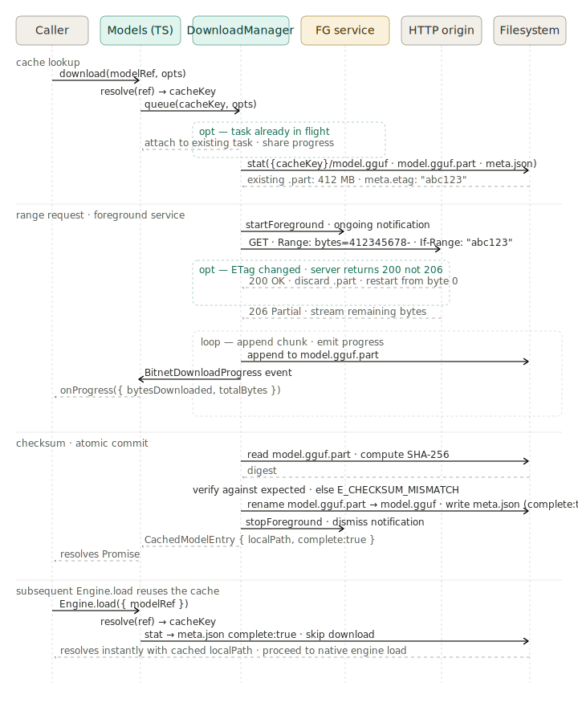

# Model lifecycle sequence: download, cache, resume, load

This document traces a model from the first `Models.download(...)` call through to a cache hit on a subsequent `Engine.load(...)`. It complements [`architecture.md`](./architecture.md) — that document is the static stack, this one is the dynamic story for the right-hand (lifecycle) column.



There are four phases. The first three are the cold-path download (cache lookup → range request → checksum + commit). The fourth is the hot path: `Engine.load` reusing the cached file without touching the network.

## Phase 1 — cache lookup

`Models.download(modelRef, opts)` is the entry point. The TS layer's first job is to canonicalize the `modelRef` (a string like `'hf://owner/repo/file.gguf'` or a raw URL) into a stable `cacheKey` via `Models.resolve(ref)`. Two different refs that resolve to the same URL produce the same cacheKey — that's how the cache deduplicates across slightly different inputs.

The TS layer then calls `nativeDownload(cacheKey, opts)`. In Kotlin, `ModelDownloader.start(...)` checks an in-process `ConcurrentHashMap<String, RunningDownload>` keyed by cacheKey:

- **Already in flight.** The new caller is attached to the existing task and shares its `BitnetDownloadProgress` stream. No duplicate HTTP request is issued. Both callers' Promises resolve from the same eventual outcome.
- **New task.** A `RunningDownload` is created and the manager probes the filesystem for `{cacheKey}/model.gguf`, `{cacheKey}/model.gguf.part`, and `{cacheKey}/meta.json`. The latter two are the signals for a resumable interrupted download — they store the byte count already received and the ETag the server returned last time.

## Phase 2 — range request and the foreground service

Before opening the connection, the manager calls `startForeground()` on `BitnetDownloadService` — an Android foreground service whose only job is to keep the process alive across user backgrounding. The service posts an ongoing notification (`POST_NOTIFICATIONS` permission required on Android 13+). Without it, a download started in the foreground would be killed within seconds of the user switching apps.

The HTTP request is then issued. When a `.part` file exists, two headers go out together:

```
Range: bytes=412345678-
If-Range: "abc123"
```

`If-Range` is the key to safe resumption. If the server's current ETag still matches `"abc123"`, the server returns `206 Partial Content` and the manager appends the new bytes to the existing `.part`. If the ETag has changed (the file on the origin was modified since the previous attempt), the server returns `200 OK` with the full body instead — the manager detects this status mismatch, discards the stale `.part`, and restarts from byte 0. There is no silent corruption path.

Inside the streaming loop, every chunk written to `.part` is followed by a `BitnetDownloadProgress` event:

```
{ cacheKey, bytesDownloaded, totalBytes, bytesPerSecond }
```

The TS layer fans this out as `opts.onProgress(...)` for the caller.

## Phase 3 — checksum and atomic commit

When the body is fully received, the manager streams `.part` through a SHA-256 digest. If the caller passed `opts.expectedSha256` and the digest doesn't match, the Promise rejects with `E_CHECKSUM_MISMATCH` and `.part` is left in place for inspection (the next download attempt will treat it as a stale resume point and re-fetch). When no expected checksum is provided, the digest is still computed and stored in `meta.json` so callers can read it back later.

On success:

1. `rename(file.part, file)` — atomic on the filesystem, so a kill at any point past this moment leaves a complete file.
2. `meta.json` is written with `complete: true`, the ETag, content-length, and SHA-256.
3. `stopForeground()` dismisses the notification.
4. The TS Promise resolves with a `CachedModelEntry { cacheKey, localPath, complete: true, ... }`.

## Phase 4 — subsequent Engine.load reuses the cache

The next `Engine.load({ modelRef })` for the same ref runs the same `resolve(ref) → cacheKey` step and hits the filesystem directly. If `meta.json` says `complete: true` and the file exists, the download stage is skipped entirely — no HTTP request, no foreground service, no progress events. The Promise resolves to the local path and the engine proceeds to its native `loadModel(path)` call.

This is the property that makes `Engine.load({ modelRef })` safe to call on every app launch: cold path is one download, warm path is one `stat`.

## What this diagram glosses over

A few details that are present in the code but not in the diagram:

- **Cross-process dedup is not provided.** The in-flight map is per-process. Two separate app processes downloading the same `cacheKey` simultaneously would race on `.part`. In practice the SDK is single-process, but a future multi-process consumer would need a file lock to be safe.
- **Retry and backoff.** The diagram shows the happy path. Network errors mid-stream surface as a rejection on the Promise; retry policy is the caller's responsibility. There is no built-in exponential-backoff loop.
- **iOS lifecycle is stub-only today.** The TS surface is identical on both platforms, but the iOS implementation rejects with `E_NOT_IMPLEMENTED`. The download flow shown here is Android-only at the time of writing. The C++ engine being platform-agnostic means an iOS port would slot in a sibling `NSURLSession`-based downloader without touching this contract.
- **`Models.resumeAll(...)`** scans the cache for incomplete `.part` files at app startup and re-queues each one through this same `Phase 2 → Phase 3` path. It is the supported way to resume after the app was force-quit mid-download.

## Related documents

- [`architecture.md`](./architecture.md) — the static layer stack this diagram animates (right-hand column).
- [`sequence-streaming.md`](./sequence-streaming.md) — companion sequence for the inference path.
- [`api/models.md`](./api/models.md) — full reference for the `Models` namespace surface.
