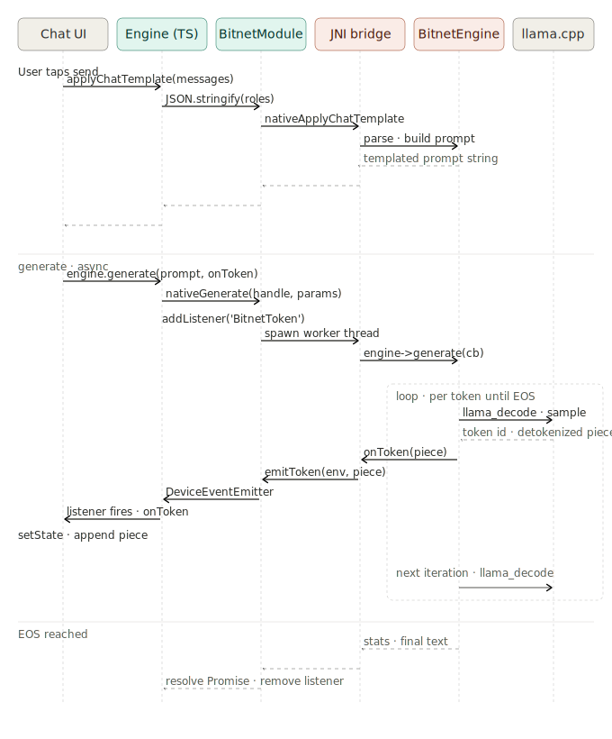

# Streaming sequence: end-to-end chat turn

This document traces one chat turn through every layer of `react-native-bitnet`, from the user tapping "send" to the streamed tokens appearing in the UI. It complements [`architecture.md`](./architecture.md): that document is the static stack, this one is the dynamic story.

There are three phases. The first is a synchronous round-trip to prepare the prompt. The second is the streaming loop where the engine generates and tokens bubble back up. The third is completion, where the promise resolves.

## Phase 1 — apply chat template

Before generating, the chat messages have to be turned into a single prompt string in the model's expected format (BitNet uses the Llama 3 chat template). This is a synchronous downcall through every layer:

1. The Chat UI calls `Engine.applyChatTemplate(messages)`.
2. The TS layer `JSON.stringify`s the message array and calls `NativeBitnet.applyChatTemplate` on the TurboModule.
3. Codegen marshals the `jstring` across the JS/JVM boundary into `BitnetModule.kt`, which invokes `nativeApplyChatTemplate` over JNI.
4. `bitnet_jni.cpp` converts the `jstring` to a `std::string`, parses the messages, and calls `BitnetEngine::applyChatTemplate`.
5. The engine builds the templated prompt and returns it as a `std::string`.

The return path is symmetric: the engine returns a string, JNI converts it back to a `jstring`, Kotlin returns it through the bridge, and TS resolves the promise. The Chat UI gets back the prompt as a plain string.

Why bother surfacing this to JS at all instead of doing it implicitly inside `generate`? Two reasons. It lets the consumer preview, edit, or log the exact prompt the model will see. And it cleanly separates two concerns — templating is deterministic and fast, generation is stochastic and slow — so an app can cache the templated prompt across retries with the same conversation.

## Phase 2 — generate (the streaming loop)

When the consumer calls `engine.generate(prompt, onToken)`, two things start happening simultaneously:

**On the downcall side.** TS calls `NativeBitnet.generate` with the prompt and parameters. Kotlin's `BitnetModule.generate` spawns a worker thread (`Thread{}.start()`) so the React Native module thread isn't blocked, then on that thread calls `nativeGenerate`. The JNI bridge calls `BitnetEngine::generate`, passing in a C++ lambda as the token callback. The engine starts its decode loop.

**On the listener side.** Before the downcall returns, the TS layer registers a `BitnetToken` listener on React Native's `NativeEventEmitter`. This is where tokens will arrive.

Inside the dashed `loop` box on the right of the diagram, one iteration looks like this:

1. `BitnetEngine` calls `llama_decode` to advance the model state by one token, then samples the next token using the configured `temperature` / `top_k` / `top_p` / `seed`.
2. The token id is converted to a UTF-8 piece via `llama_token_to_piece`.
3. The engine invokes the C++ callback that was passed in, with the piece string.
4. The callback (constructed in `bitnet_jni.cpp`) calls `emitToken(env, piece)` — which uses `env->CallVoidMethod` to invoke the corresponding Kotlin method on the module instance.
5. Kotlin's `emitToken` builds a `WritableMap` containing the piece and dispatches it through `DeviceEventEmitter` (specifically, `RCTDeviceEventEmitter.emit("BitnetToken", payload)`).
6. The event crosses back into JS, where `NativeEventEmitter` delivers it to the listener registered in step 0.
7. The listener invokes the consumer's `onToken` callback, which calls `setState` to append the piece to the message being assembled.

This loop runs once per token. On the Pixel 10 emulator, that's roughly once every two seconds; on a real DOTPROD-capable phone, expect 5–15 tokens per second. The decode itself dominates the wall-clock time. The full callback walk-up takes tens of microseconds and is irrelevant to user-visible latency.

The crucial design property visible in this phase: **the downcall and the upcall use different mechanisms**. Method calls go down as Promises (request/response). Token events come up as `DeviceEventEmitter` events (pub/sub). This asymmetry is the whole point. A Promise can only resolve once, so it cannot deliver N tokens. An event stream has no built-in mechanism for "request started" or "request finished", so it can't model a method call. Using both, each in the direction it's good at, is what `ADR-003` defends.

## Phase 3 — EOS reached

When the decode loop hits the model's end-of-sequence token, a configured stop sequence, the `max_tokens` cap, or a cancel signal, it exits. The engine fills in a `GenerationResult` — the accumulated text, a `finish_reason`, the prompt-token count, the completion-token count, and the wall-clock time — and returns it to JNI. JNI serializes that struct to JSON; Kotlin parses it, builds a nested `WritableMap` (with a `usage` sub-map for OpenAI parity), and resolves the deferred Promise. The TS layer's `await` unblocks with a `GenerationResult` of shape `{ text, finishReason: 'length' | 'stop' | 'cancelled', usage: { promptTokens, completionTokens, totalTokens }, wallTimeMs }`. Tokens-per-second is not part of the result struct itself; it's a one-line JS-side derivation (`usage.completionTokens / (wallTimeMs / 1000)`) when callers want it.

In the TS layer's `.finally()` handler, the `BitnetToken` listener registered in Phase 2 is removed. This matters: without it, a second `generate()` call would fire its events into both the new listener *and* the old one, causing every token to appear in the UI twice.

The Chat UI's `await engine.generate(...)` finally returns. It typically uses this moment to switch the typing indicator off, persist the message, and enable the input field for the next turn.

## What this diagram glosses over

A few details that are present in the code but not in the diagram:

- **Cancellation.** `engine.cancel()` flips an `std::atomic<bool>` on the engine that the decode loop checks each iteration. The engine returns early; the upward stream of token events stops; the promise resolves (does not reject) with `finishReason: 'cancelled'` and `text` containing whatever was generated before the cancel.
- **Backpressure.** None. The C++ callback fires synchronously on the worker thread, blocking it until the JNI call completes. The JS event loop is not consulted. On the rare devices where token generation could outpace the JS event loop's ability to process them, tokens queue up in the bridge.
- **Threading on the JNI side.** `emitToken` uses `env->CallVoidMethod`, which requires the calling thread to be attached to the JVM. Since the callback fires on the worker thread that Kotlin spawned (and which Kotlin attached to the JVM before crossing the JNI boundary), the env pointer is valid. A different threading scheme — say, the engine spawning its own thread — would need explicit `AttachCurrentThread` / `DetachCurrentThread` calls.

## Related documents

- [`architecture.md`](./architecture.md) — the static layer stack this diagram animates.
- [`adr/003-streaming-api.md`](./adr/003-streaming-api.md) — why the streaming API has this exact shape, and what JSI would change.
- [`known-issues.md`](./known-issues.md) — current limitations including the `@@@@@@` divergence (compute-level, not bridge-level).
